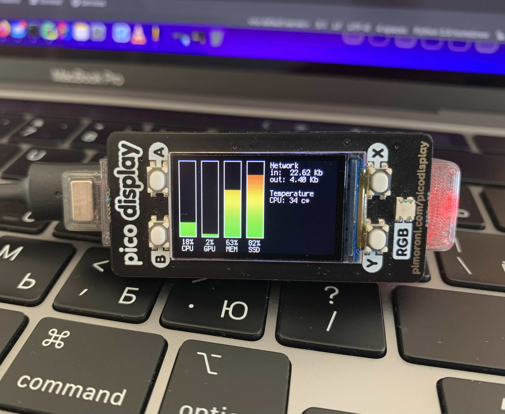

# Tiny System Monitor

An external system monitor for your computer.


[Demo video](https://twitter.com/dr2mod/status/1557773285022203904)

## Hardware

### Bill of materials

* Raspberry Pi Pico
* Pico Display Pack
* Optional: LED + Resistor

### Print

The 3d model can be downloaded from my Printables [here](https://www.printables.com/social/306904-dmytro-panin/models).

## Software

The software is written in CircuitPython and tested with the version 7.3.1

### Installing CircuitPython

1. Download the CircuitPython UF2 from the official website [here](https://circuitpython.org/board/raspberry_pi_pico/).
2. Push and hold the BOOTSEL button and plug your Pico into the USB port of your computer. Release the BOOTSEL button
   after your microcontroller is connected.
3. It will mount as a Mass Storage Device called RPI-RP2.
4. Drag and drop the CircuitPython UF2 file onto the RPI-RP2 volume.

### Software installation

Download and copy the software

```shell
cd ~
git clone https://github.com/dr-mod/tiny-system-monitor.git
cp tiny-system-monitor/src/pico/* <CIRCUITPY DRIVE>
```

### The host part

For the system to work it requires a process to be running in your system collecting the necessary data and sending it to
your _Tiny System Monitor_. It makes use of the psutil library that's mostly cross-platform, but you might want to tweak the configuration.

```shell
pip3 install psutil
```

To get the data about your GPU load and CPU Temperature, you need to create your own implementation as to how to fetch it. I've provided with my example for GPU. 

Make sure to change the port your _Tiny System Monitor_ is connected to before running the host, otherwise no data will be updated on the device.
```shell
python3 tiny-system-monitor/src/host/run.py
```

### Support the project

If you would like to support what I do and keep me caffeinated, you can do it here:

[](https://www.buymeacoffee.com/drmod)
